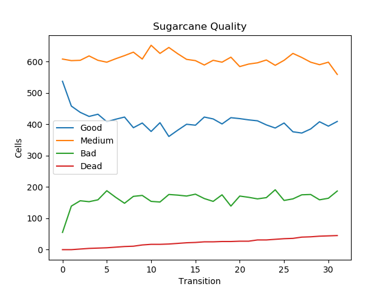
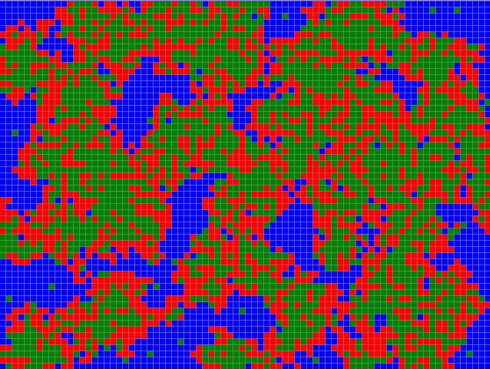

# Sugarcane Compartimental Model

<b>Objective:</b> simulate quality in a sugar cane plantation

<b>Compartments:</b> Good, Medium, Bad

<b>Variables:</b> Phase, Quality Score (Temp,Umid,Wind,Lumi)

<b>Compartimental model</b> 

<b>Cellular automata</b>

